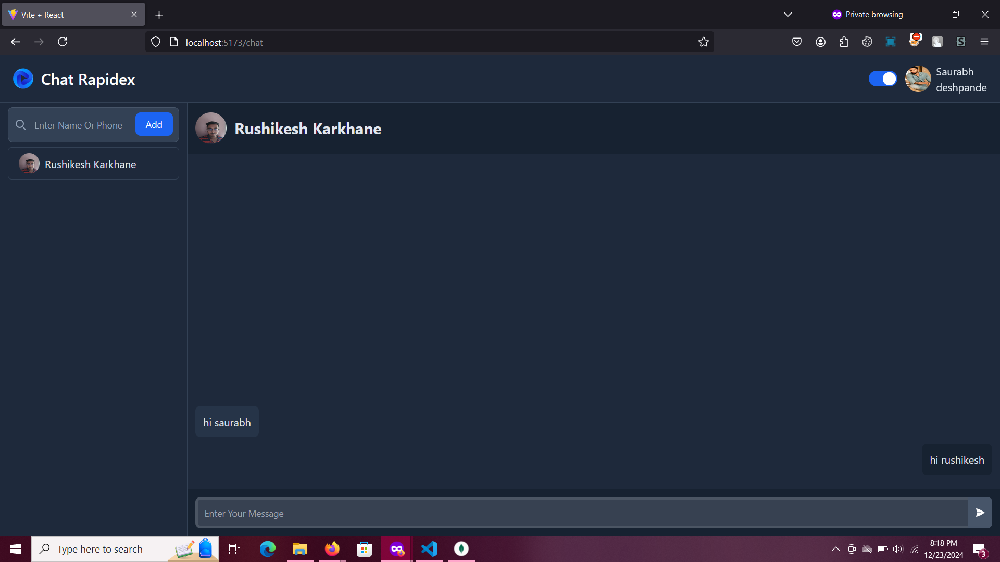
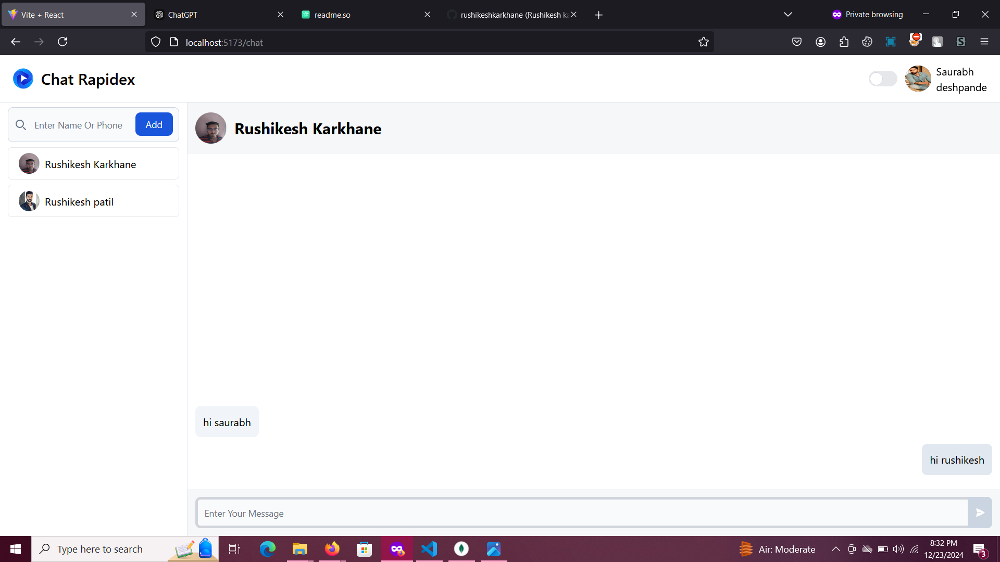
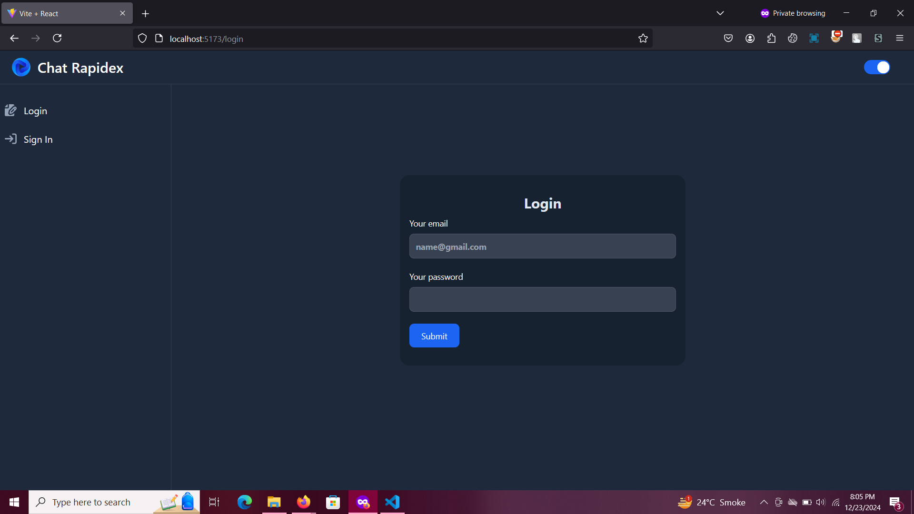
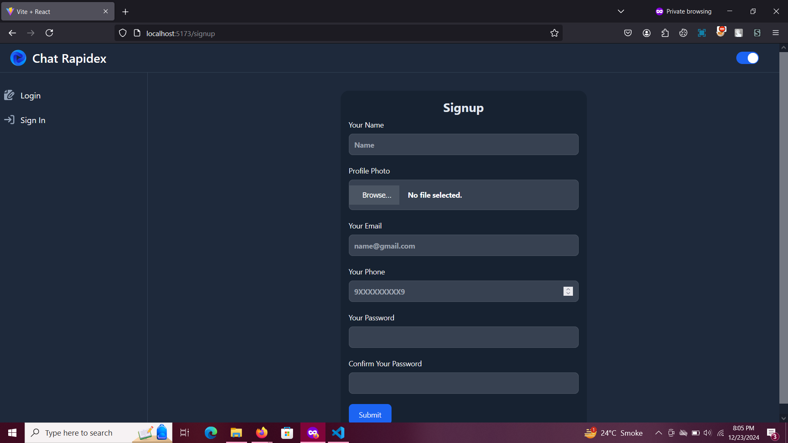

# Chat Rapidex

Chat Rapidex is a simple, fast, and user-friendly chat application that provides an intuitive messaging experience. It comes with an authentication system, and support for both dark and light modes.,this has only core features,additional features like deleting message,profile page will be added further

## Features

- **Real-time Messaging**: Allows users to send and receive messages instantly.
- **Authentication System**: Secure login and registration, with user authentication for a personalized experience.
- **Dark Mode and Light Mode**: Easily switch between dark and light modes for comfortable chatting in any environment.
- **Responsive Design**: Optimized for both mobile and desktop devices, ensuring a seamless experience.


## Installation

### Prerequisites

- Node.js (>= 14.x.x)
- NPM for backend vite for frontend (for package management)
- MongoDB (for storing user data, messages, etc.)

### Steps

  ##### 1. Clone the repository:

   ```bash
   git clone https://github.com/rushikeshkarkhane822/chat-application-in-react-mern-simple-design
   cd chat-application-in-react-nodejs-mern-stack
   cd backend
   npm install
   cd frontend 
   npm install 
   ```

   ##### 2. Setup Environment Variables:
   - make a file config.env in backend folder and paste these basic details, these are general details you can change it 
   ```
    PORT = 3001
    CONN = "mongodb://127.0.0.1:27017/chatrapidex"
    JWT_SECRET = uygfdcuyrget6ryuihejuifwhyuifwjecduihrygiwehfryhiwejuhfryg
   ```
   ##### 3. start the project:
   ```bash
   cd backend
   nodemon app.js
   # new terminal
   cd frontend
   vite
   ```

## screenshots






